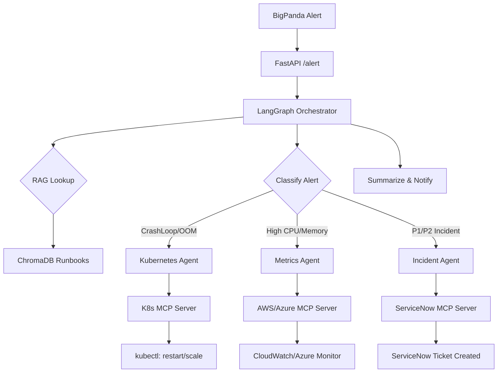

# 🤖 Agentic SRE Platform

[](https://github.com/balakrishna-valluri-bala/agentic-sre-platform/actions/workflows/ci.yml)
[](https://www.python.org/downloads/)
[](https://www.terraform.io/)
[](LICENSE)
[](https://github.com/langchain-ai/langgraph)

> **Production-grade multi-agent SRE system** that automatically diagnoses and remediates Kubernetes incidents using LangGraph, MCP tool servers, RAG-powered runbook retrieval, and A2A agent coordination — deployed on both AWS EKS and Azure AKS.

**Author:** Balakrishna V | Principal Architect / Agentic AI Engineer | CareFirst BCBS
**GitHub:** [@balakrishna-valluri-bala](https://github.com/balakrishna-valluri-bala)

---

## 📐 Architecture

```
BigPanda / Datadog Alert
         │
         ▼
  ┌─────────────┐
  │  FastAPI     │  POST /alert
  │  (port 8000) │
  └──────┬──────┘
         │
         ▼
  ┌─────────────────────────────────────────────────────┐
  │          LangGraph Orchestrator Agent                │
  │                                                      │
  │  receive_alert → rag_lookup → classify_alert         │
  │         │                          │                 │
  │         ▼                          ▼                 │
  │   ChromaDB RAG           [CrashLoop|CPU|Metrics|DB]  │
  │   (runbook lookup)                 │                 │
  │                                    ▼                 │
  │              ┌─────────────────────────────────┐    │
  │              │    Agent Router (A2A)            │    │
  │              └──┬──────────┬──────────┬─────────┘    │
  │                 │          │          │              │
  │                 ▼          ▼          ▼              │
  │         ┌──────────┐ ┌─────────┐ ┌──────────┐      │
  │         │K8s Agent │ │Metrics  │ │Incident  │      │
  │         │          │ │Agent    │ │Agent     │      │
  │         └────┬─────┘ └────┬────┘ └────┬─────┘      │
  │              │             │           │             │
  └──────────────┼─────────────┼───────────┼─────────────┘
                 │             │           │
        ┌────────▼──┐  ┌───────▼───┐  ┌───▼──────────┐
        │  K8s MCP  │  │  AWS MCP  │  │ ServiceNow   │
        │  Server   │  │  Azure    │  │ MCP Server   │
        │ (kubectl) │  │  Monitor  │  │              │
        └───────────┘  └───────────┘  └──────────────┘
```

**Mermaid flowchart:**


---

## ✨ Features

| Feature | Description |
|---------|-------------|
| **Multi-Agent Orchestration** | LangGraph state machine coordinates 4 specialized agents |
| **RAG Runbook Retrieval** | ChromaDB semantic search over 10 production SRE runbooks |
| **MCP Tool Servers** | 4 servers: Kubernetes, AWS, Azure, ServiceNow — 25 total tools |
| **A2A Agent Discovery** | Agents register capabilities; router delegates tasks automatically |
| **Auto-Remediation** | Pod restart, scale-up, node drain — no human intervention for P3/P4 |
| **Multi-Cloud** | Deploys on both AWS EKS and Azure AKS via Helm + Terraform |
| **Full Observability** | Prometheus metrics + Grafana dashboards included |
| **HIPAA Ready** | All secrets in Key Vault / Secrets Manager, encrypted at rest |

**Key Metrics (from production CareFirst BCBS):**
- ⬇️ MTTD: 10-15 min → **2-5 min**
- ⬇️ MTTR: 45-90 min → **15-30 min**
- 🤖 Auto-remediated: **40% of P3/P4 incidents**

---

## 🚀 Quick Start

### Prerequisites
- Python 3.11+
- Docker + Docker Compose
- kubectl (for K8s features)
- Terraform 1.5+ (for cloud deployment)

### Local Development

```bash
# 1. Clone the repo
git clone https://github.com/balakrishna-valluri-bala/agentic-sre-platform.git
cd agentic-sre-platform

# 2. Set up environment
cp .env.example .env
# Edit .env — add your OPENAI_API_KEY at minimum

# 3. Start all services
docker-compose up -d

# 4. Ingest runbooks into ChromaDB
python rag/ingest.py

# 5. Test the API
curl -X POST http://localhost:8000/alert \
  -H "Content-Type: application/json" \
  -d '{
    "alert_type": "CrashLoopBackOff",
    "severity": "high",
    "namespace": "production",
    "pod_name": "api-server-7d9b8f-xyz",
    "message": "Pod restarted 8 times in last 10 minutes",
    "source": "bigpanda"
  }'
```

### Expected Response
```json
{
  "alert_id": "alert-abc123",
  "status": "remediated",
  "assigned_agent": "kubernetes-agent",
  "remediation_steps": [
    "Retrieved runbook: crashloopbackoff.md",
    "Fetched pod logs: OOMKilled — memory limit exceeded",
    "Restarted pod: api-server-7d9b8f-xyz",
    "Updated memory limit from 512Mi to 1Gi"
  ],
  "incident_number": null,
  "summary": "CrashLoopBackOff resolved via pod restart. Root cause: OOMKill due to memory limit. Recommended: increase memory limit."
}
```

---

## 📡 API Reference

| Method | Endpoint | Description |
|--------|----------|-------------|
| `POST` | `/alert` | Process incoming SRE alert |
| `POST` | `/chat` | Conversational SRE assistant |
| `GET`  | `/agents` | List registered A2A agents |
| `GET`  | `/runbooks?query=<text>` | Semantic runbook search |
| `GET`  | `/health` | Health check |

### POST /alert — Request Body
```json
{
  "alert_type": "CrashLoopBackOff | HighCPU | OOMKilled | NodeNotReady | ...",
  "severity": "critical | high | medium | low",
  "namespace": "production",
  "pod_name": "my-pod-xyz",
  "message": "Human-readable alert description",
  "source": "bigpanda | datadog | pagerduty"
}
```

---

## 🧠 Agent Architecture

### Orchestrator (`agents/orchestrator.py`)
LangGraph StateGraph with 7 nodes. Maintains full conversation state across multi-turn interactions. Uses MemorySaver for persistence.

### Kubernetes Agent (`agents/kubernetes_agent.py`)
ReAct agent with 6 tools via the K8s MCP server. Diagnoses pod failures, reads logs, restarts pods, and scales deployments.

### Metrics Agent (`agents/metrics_agent.py`)
Queries Datadog API and AWS CloudWatch. Performs anomaly detection with pandas. Generates natural-language insights.

### Incident Agent (`agents/incident_agent.py`)
Creates, updates, and closes ServiceNow incidents. Includes deduplication — won't create a duplicate ticket for the same alert.

### RAG Agent (`agents/rag_agent.py`)
Semantic + keyword hybrid search over ChromaDB runbook collection. Returns ranked runbooks with similarity scores.

---

## 🔧 MCP Servers

| Server | Port | Tools |
|--------|------|-------|
| `kubernetes_mcp.py` | 8001 | get_pod_status, get_pod_logs, restart_pod, scale_deployment, get_node_status, get_events |
| `aws_mcp.py` | 8002 | get_cloudwatch_metrics, get_alarms, describe_eks_cluster, get_eks_nodegroups, put_metric_data, get_log_events |
| `azure_mcp.py` | 8003 | get_aks_cluster, get_azure_metrics, get_azure_alerts, get_log_analytics_query, get_keyvault_secret |
| `servicenow_mcp.py` | 8004 | create_incident, update_incident, get_incident, close_incident, search_incidents |

---

## 📚 RAG System

10 production runbooks covering:
`crashloopbackoff` · `high-cpu-usage` · `pod-oom-killed` · `deployment-failed` · `node-not-ready` · `pvc-pending` · `service-unavailable` · `etcd-backup` · `alert-fatigue` · `database-connection`

**Ingestion:** `python rag/ingest.py`
**Chunking:** RecursiveCharacterTextSplitter (chunk_size=500, overlap=50)
**Embeddings:** OpenAI text-embedding-3-small
**Vector Store:** ChromaDB

---

## ☁️ Infrastructure Deployment

### AWS EKS
```bash
cd infrastructure/aws
terraform init
terraform plan
terraform apply
aws eks update-kubeconfig --region us-east-1 --name sre-platform-eks
helm upgrade --install agentic-sre ./helm/agentic-sre -n sre-platform
```

### Azure AKS
```bash
cd infrastructure/azure
terraform init
terraform plan
terraform apply
az aks get-credentials --resource-group sre-platform-rg --name sre-platform-aks
helm upgrade --install agentic-sre ./helm/agentic-sre -n sre-platform
```

---

## 🏗️ Project Structure

```
agentic-sre-platform/
├── agents/          # LangGraph + LangChain agents
├── mcp_servers/     # FastAPI MCP tool servers
├── a2a/             # Agent-to-Agent registry and routing
├── rag/             # ChromaDB RAG pipeline + runbooks
├── api/             # FastAPI main application
├── infrastructure/  # Terraform: AWS + Azure
├── helm/            # Helm chart for K8s deployment
├── tests/           # pytest unit tests
└── .github/         # CI/CD workflows
```

---

## 🤝 Contributing

1. Fork the repo
2. Create a feature branch: `git checkout -b feature/my-feature`
3. Run tests: `pytest tests/ -v`
4. Format code: `black .`
5. Submit a PR

---

## 📜 License

MIT License — see [LICENSE](LICENSE)

---

*Built by [Balakrishna V](https://github.com/balakrishna-valluri-bala) — Principal Architect / Agentic AI Engineer*
